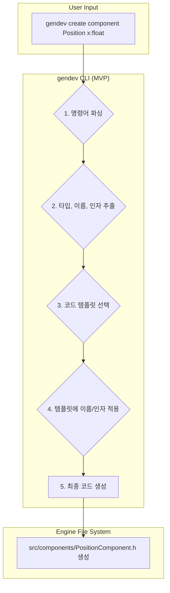

# DirectX 12 게임 엔진: 개발 계획 및 진행 상황

**엔진 목표:** 팩토리오의 자동화, Outpost: Infinity Siege의 기지 구축/디펜스, No Man's Sky 스타일의 광활한 탐험/상호작용을 지원하는 유연하고 강력한 DX12 기반 게임 엔진 개발. LLM 기반의 지능형 개발 어시스턴트 기능 내장.

**최우선 목표 (MVP):** 절차적 월드 생성(PCG) 및 기본 탐험 기능 구현

---

## I. 코어 시스템 (Core Systems)

| 기능/시스템                 | 우선순위/MVP | 상태        | 세부 내용 및 목표                                                                | MCP 연동 / LLM 지원 아이디어                                                                                                                              |
| :-------------------------- | :----------- | :---------- | :------------------------------------------------------------------------------- | :------------------------------------------------------------------------------------------------------------------------------------------------------ |
| **1. ECS 아키텍처**         | MVP          | 계획 완료   | 엔티티, 컴포넌트, 시스템 기반 설계. 데이터 지향.                                       | - 정의된 컴포넌트/시스템 목록 MCP로 제공.<br>- LLM: 특정 객체에 필요한 컴포넌트 조합 추천, 시스템 로직 초안 생성.                                                    |
| **2. 메모리 관리자**        | MVP          | 구상 중     | 기본 풀 할당자, 간단한 오브젝트 풀링 (PCG 생성 요소 대상).                               | - MCP: 현재 메모리 사용 패턴.<br>- LLM: 특정 상황 메모리 최적화 전략 추천.                                                                                       |
| **3. 리소스 관리자**        | MVP          | 구상 중     | 애셋(메시, 텍스처) 기본 로드/언로드. 비동기 로딩 (기초).                                  | - MCP: 프로젝트 애셋 목록, 선택된 애셋 정보.<br>- LLM: 애셋 포맷 변환/최적화 가이드, 애셋 의존성 분석.                                                               |
| 4. 멀티스레딩 & 잡 시스템   | Phase 2      | 계획 중     | 기본 잡 시스템 구현 (PCG 연산, 물리 등 일부 병렬화).                                   | - MCP: 현재 잡 시스템 구성, 특정 시스템 코드.<br>- LLM: 시스템 병렬화 방안 제안, 잡 의존성 설정 조언.                                                                  |
| 5. 스크립팅 시스템 (Lua/Py) | Phase 2      | 계획 중     | 스크립트 언어 내장, C++ 바인딩 (게임플레이 로직 및 에디터 확장용).                          | - MCP: C++ API 목록, 현재 스크립트 컨텍스트.<br>- LLM: C++ 함수 스크립트 바인딩 코드 생성, 게임 로직 스크립트 초안 작성.                                                  |

---

## II. 렌더링 시스템 (DirectX 12 기반)

| 기능/시스템                      | 우선순위/MVP | 상태        | 세부 내용 및 목표                                                                 | MCP 연동 / LLM 지원 아이디어                                                                                                                               |
| :------------------------------- | :----------- | :---------- | :-------------------------------------------------------------------------------- | :------------------------------------------------------------------------------------------------------------------------------------------------------- |
| **1. 기본 DX12 파이프라인**      | MVP          | 구상 중     | DX12 초기화, 커맨드 관리, 기본 리소스(버퍼/텍스처) 생성, PSO/루트 시그니처 관리.         | - MCP: 셰이더 코드, 리소스 바인딩 정보.<br>- LLM: HLSL 셰이더 초안 생성, PSO/루트 시그니처 설정 코드 생성, DX12 API 사용법 질의응답.                                 |
| **2. PCG 지형 렌더링**         | MVP          | **진행 예정** | 높이맵 기반 지형 메시 생성 및 렌더링. 기본 LOD, 청크 기반 렌더링.                       | - MCP: 지형 데이터 포맷, LOD 설정값.<br>- LLM: 지형 LOD 알고리즘 선택 및 파라미터 설정 조언, 지형 렌더링 최적화 아이디어 제공.                                       |
| 3. PBR 머티리얼 시스템           | Phase 2      | 계획 중     | Metallic-Roughness PBR 셰이더, IBL, 기본 머티리얼 에디터 인터페이스.                  | - MCP: 선택된 머티리얼 파라미터, 셰이더 코드.<br>- LLM: 특정 재질 PBR 값 가이드, PBR 셰이더 디버깅 지원.                                                            |
| 4. 조명 및 그림자                | Phase 2      | 계획 중     | 방향광, 점광원, 스포트라이트. 동적 섀도우맵 (CSM).                                   | - MCP: 씬 조명 설정, 그림자 파라미터.<br>- LLM: 특정 분위기 연출 조명 설정 제안, 그림자 품질/성능 최적화 조언.                                                          |
| 5. 후처리 효과 (기본)            | Phase 2      | 계획 중     | 톤 매핑, 블룸, 기본 안티앨리어싱 (FXAA).                                            | - MCP: 현재 후처리 스택 정보.<br>- LLM: 특정 스타일에 맞는 후처리 조합 추천, 후처리 셰이더 코드 작성 지원.                                                              |
| 6. 인스턴싱 렌더링               | MVP          | 구상 중     | 동일 메시 대량 렌더링 최적화 (예: PCG로 생성된 나무, 돌).                               | - MCP: 인스턴싱 대상 메시 정보, 현재 씬 구성.<br>- LLM: 인스턴싱 적용 적합성 판단, 인스턴싱 관련 셰이더 수정 제안.                                                        |

---

## III. 절차적 생성 (PCG) 특화 시스템

| 기능/시스템                         | 우선순위/MVP | 상태        | 세부 내용 및 목표                                                                 | MCP 연동 / LLM 지원 아이디어                                                                                                                                  |
| :---------------------------------- | :----------- | :---------- | :-------------------------------------------------------------------------------- | :---------------------------------------------------------------------------------------------------------------------------------------------------------- |
| **1. 노이즈 기반 지형 생성기**        | MVP          | **진행 예정** | Perlin/Simplex 노이즈 알고리즘 활용. 높이맵 생성 (CPU 우선, GPU 가속은 Phase 2).       | - MCP: 노이즈 파라미터(시드, 스케일, 옥타브 등), 선택된 알고리즘.<br>- LLM: 특정 지형 스타일(산, 계곡)을 위한 노이즈 파라미터 조합 추천, 알고리즘 원리 설명.         |
| **2. 절차적 자원/오브젝트 배치**    | MVP          | 구상 중     | 생성된 지형 위 자원(광물, 나무), 간단한 구조물(유적 파편 등) 규칙/확률 기반 배치.          | - MCP: 배치 규칙, 대상 오브젝트 목록, 지형 데이터.<br>- LLM: 자연스러운 자원 분포/오브젝트 배치 규칙 아이디어 제공, 배치 스크립트 초안 작성.                             |
| 3. (고급) 절차적 구조물 생성기 (기초) | Phase 3      | 계획 중     | 간단한 규칙 기반 건물/던전 레이아웃 생성 기초 (BSP, 셀룰러 오토마타 등).                 | - MCP: 구조물 생성 파라미터, 사용 알고리즘.<br>- LLM: 다양한 구조물 생성 알고리즘 비교 설명, 알고리즘 구현 아이디어 제공.                                           |

---

## IV. 게임플레이 시스템 (Gameplay Systems)

| 기능/시스템                      | 우선순위/MVP | 상태    | 세부 내용 및 목표                                                              | MCP 연동 / LLM 지원 아이디어                                                                                                                    |
| :------------------------------- | :----------- | :------ | :----------------------------------------------------------------------------- | :-------------------------------------------------------------------------------------------------------------------------------------------- |
| **1. 씬 관리 시스템 (기본)**     | MVP          | 계획 중   | 씬 데이터(ECS) 저장/로드.                                                       | - MCP: 현재 씬 구조, 엔티티/컴포넌트 목록.<br>- LLM: 씬 구성 최적화 방안 제시.                                                                     |
| **2. 입력 시스템 (기본)**        | MVP          | 계획 중   | 키보드/마우스 입력 처리, 간단한 액션 매핑.                                        | - MCP: 현재 입력 매핑 설정.<br>- LLM: 특정 입력 처리 로직(더블클릭 등) 스크립트 생성.                                                                 |
| 3. 물리 시스템 (기본 충돌)       | Phase 2      | 계획 중   | 간단한 충돌 감지 (AABB vs AABB), 레이캐스팅 (탐험/상호작용용).                     | - MCP: 충돌체 정보, 물리 관련 코드.<br>- LLM: 물리 현상 구현 파라미터 조언, 충돌 처리 로직 디버깅 지원.                                                   |
| 4. UI 시스템 (기본)              | Phase 2      | 계획 중   | 간단한 텍스트, 이미지 표시 (디버그 정보, 간단한 HUD). Dear ImGui 에디터용 우선. | - MCP: UI 레이아웃 정보, UI 요소 속성.<br>- LLM: 간단한 UI 레이아웃 코드 생성, UX 개선 아이디어 제공.                                                        |
| 5. 오디오 시스템 (기초)          | Phase 3      | 계획 중   | 간단한 2D 사운드 재생.                                                          | - MCP: 사용 가능한 사운드 애셋 목록.<br>- LLM: 특정 상황에 어울리는 사운드 이펙트 아이디어.                                                              |
| 6. 애니메이션 시스템 (기초)      | Phase 3      | 계획 중   | 스켈레탈 애니메이션 로딩 및 재생 (플레이어/NPC용).                               | - MCP: 애니메이션 데이터, 상태 머신 구성.<br>- LLM: 간단한 애니메이션 상태 머신 로직 제안.                                                               |

---

## V. 개발 도구 (Editor & Tools)

| 기능/시스템                      | 우선순위/MVP | 상태        | 세부 내용 및 목표                                                                | MCP 연동 / LLM 지원 아이디어                                                                                                                                 |
| :------------------------------- | :----------- | :---------- | :------------------------------------------------------------------------------- | :--------------------------------------------------------------------------------------------------------------------------------------------------------- |
| **1. 기본 3D 뷰포트**            | MVP          | 구상 중     | 생성된 PCG 월드 시각화, 기본 카메라 조작(이동, 회전).                                | - MCP: 현재 뷰포트 카메라 정보, 렌더링 설정.<br>- LLM: 뷰포트 제어 스크립트 작성 지원.                                                                          |
| **2. PCG 파라미터 에디터**       | MVP          | 구상 중     | 노이즈 설정, 시드 값 등 PCG 관련 파라미터를 UI로 조작하고 실시간 결과 확인.            | - MCP: 현재 PCG 파라미터 값, 에디터 UI 구성.<br>- LLM: 파라미터 변경에 따른 예상 결과 설명, UI 요소 배치 아이디어.                                                    |
| 3. 씬 에디터 (기본)              | Phase 2      | 계획 중     | 엔티티 선택/조작(이동/회전/크기), 컴포넌트 속성 편집.                                | - MCP: 선택된 엔티티/컴포넌트 정보, 에디터 상태.<br>- LLM: 에디터 기능 사용법 안내, 에디터 확장 스크립트 작성 지원.                                                   |
| 4. 애셋 브라우저 (기본)          | Phase 2      | 계획 중     | 프로젝트 애셋 목록 표시, 간단한 임포트 기능.                                      | - MCP: 프로젝트 폴더 구조, 애셋 메타데이터.<br>- LLM: 자연어 기반 애셋 검색 (예: "붉은색 폭발 파티클 찾아줘").                                                       |
| 5. 디버깅/프로파일링 도구 (기본) | Phase 2      | 계획 중     | FPS 카운터, 콘솔 로그, 간단한 렌더링 통계.                                        | - MCP: 프로파일링 데이터, 오류 로그.<br>- LLM: 프로파일링 데이터 분석 후 성능 병목 지점 추론, 오류 메시지 분석 및 해결책 제시.                                          |

---

## VI. 지능형 개발 도우미: `gendev` CLI

**컨셉:** `gendev`는 개발 워크플로우에 직접 통합되어 생산성을 극대화하는 것을 목표로 하는 지능형 CLI(Command-Line Interface) 도구입니다.

*   **MVP 목표 (엔진 개발용 내부 도구):** 엔진 개발자가 ECS 아키텍처의 핵심 요소(Component, System, Event)를 생성하는 반복적인 작업을 자동화하여, 엔진 자체의 개발 속도를 높이는 데 집중합니다. 생성된 코드는 엔진 프로젝트(`d:/Game_Engine`)에 직접 포함됩니다.
*   **Post-MVP 목표 (게임 개발용 외부 도구):** 엔진을 사용하는 게임 개발자에게 배포되어, 최종 게임 프로젝트의 코드 생성을 돕는 도구로 기능을 확장합니다.

| 기능/목표 | 우선순위/MVP | 상태 | 세부 내용 및 목표 |
| :--- | :--- | :--- | :--- |
| **1. `gendev` CLI 기반 설계** | MVP | **계획 완료** | C++ 기반 CLI 애플리케이션. `create`, `ask` 등 명령어와 하위 명령어 파싱. |
| **2. `ask` 명령어** | MVP | **계획 완료** | `gendev ask "질문"` 형태로 엔진/프로젝트 관련 질의응답. `Project.md`를 주 지식 기반으로 활용. |
| **3. `create` 명령어 상세 기획** | MVP | **계획 완료** | `gendev create <type> <name> [args...]` 형태로 ECS 요소 코드 파일 생성. |
| &nbsp;&nbsp; - **생성 타입** | MVP | **계획 완료** | `component`, `system`, `event` 3가지 타입을 지원합니다. |
| &nbsp;&nbsp; - **파일 위치** | MVP | **계획 완료** | 엔진 소스 `src/` 폴더 내 `components/`, `systems/`, `events/` 에 각각 생성됩니다. |
| &nbsp;&nbsp; - **인자 처리** | MVP | **계획 완료** | Component/Event의 멤버는 `이름:타입` 형식으로 전달받습니다. (예: `x:float`) |
| **4. 빌드 시스템 통합** | Post-MVP | **계획 완료** | `gendev create` 실행 시 `--update-cmake` 플래그로 `CMakeLists.txt`에 새 소스 파일 자동 추가. (상세 사양 참조) |

### `gendev ask` 명령어 세부 사양

#### 1. 명령어 형식

`gendev ask "[질문 내용]"`

*   **예시:**
    *   `gendev ask "엔진의 ECS 아키텍처는 어떻게 설계되어 있나요?"`
    *   `gendev ask "PositionComponent는 어떤 멤버를 가지고 있어?"`

#### 2. 검색 대상 (지식의 범위)

질의응답의 정확도를 높이기 위해, 프로젝트의 핵심 정보를 담고 있는 다음 파일들을 주된 검색 대상으로 정의합니다.

*   **문서 파일:** 프로젝트 내 모든 `.md` 파일 (예: `Project.md`, `README.md` 등)
*   **C++ 헤더 파일:** `.h`, `.hpp`
*   **C++ 소스 파일:** `.cpp`, `.cxx`
*   **빌드 설정 파일:** `CMakeLists.txt`

#### 3. 동작 프로세스

`gendev ask` 명령어는 다음 단계에 따라 동작합니다.

1.  **질문 분석 (키워드 추출):** 사용자의 질문 문자열에서 핵심 키워드를 추출합니다. (예: "ECS 아키텍처", "PositionComponent", "멤버")
2.  **파일 검색 (키워드 매칭):** 정의된 검색 대상 파일들 내에서 추출된 키워드와 일치하는 내용을 찾습니다.
3.  **관련 정보 추출:** 키워드가 포함된 라인과 문맥을 파악할 수 있는 주변 라인들을 함께 추출합니다.
4.  **관련도 순 정렬:** 키워드 일치 빈도, 파일의 중요도(예: `Project.md`에 가중치 부여) 등을 고려하여 검색된 정보들의 순위를 매깁니다.
5.  **결과 생성 및 출력:** 가장 관련도가 높다고 판단되는 정보들을 정해진 형식에 맞춰 사용자에게 보여줍니다.

##### 작업 흐름도 (Mermaid)

```mermaid
graph TD
    subgraph User Input
        A["`gendev ask \"PositionComponent의 멤버는?\"`"]
    end

    subgraph "gendev ask CLI"
        B{1. 질문 분석<br/>(키워드: "PositionComponent", "멤버")};
        C{2. 대상 파일 검색<br/>(*.md, *.h, *.cpp, CMakeLists.txt)};
        D{3. 관련 정보 추출<br/>(키워드 포함 라인 + 주변 문맥)};
        E{4. 관련도 순 정렬};
        F[5. 최종 답변 생성];
    end

    subgraph "Knowledge Base (Project Files)"
        G["Project.md"]
        H["src/components/PositionComponent.h"]
        I["src/systems/MovementSystem.cpp"]
    end
    
    subgraph "Output"
        J["관련도 높은 정보 출력"];
    end

    A --> B --> C;
    C -- 검색 --> G;
    C -- 검색 --> H;
    C -- 검색 --> I;
    
    G --> D;
    H --> D;
    I --> D;
    
    D --> E --> F --> J;
```

#### 4. 출력 형식

검색된 정보를 명확하게 전달하기 위해, **`[파일 경로]:[라인 번호]`** 와 함께 **해당 코드/문서의 일부**를 보여주는 형식을 사용합니다.

*   **예시 질문:** `gendev ask "PositionComponent"`
*   **예상 출력:**

```
Found relevant information in 2 files:

[1] d:/Game_Engine/src/components/PositionComponent.h
...
 25 |     #pragma once
 26 |
 27 |     struct PositionComponent {
 28 |         float x;
 29 |         float y;
 30 |     };
...

[2] d:/Game_Engine/Project.md
...
104 | │   ├── components/
105 | │   │   └── PositionComponent.h
106 | │   ├── systems/
...
```

---

### `gendev create` 명령어 세부 사양

#### 1. 명령어 형식

*   **Component:** `gendev create component [ComponentName] [member1_name]:[member1_type] ...`
    *   *예시:* `gendev create component Position x:float y:float z:float`
*   **System:** `gendev create system [SystemName]`
    *   *예시:* `gendev create system Physics`
*   **Event:** `gendev create event [EventName] [data1_name]:[data1_type] ...`
    *   *예시:* `gendev create event Collision entity1:int entity2:int`

#### 2. 디렉토리 구조

`gendev` CLI를 실행하는 엔진 프로젝트 루트(`d:/Game_Engine/`) 기준입니다.

```
d:/Game_Engine/
├── src/
│   ├── components/
│   │   └── PositionComponent.h
│   ├── systems/
│   │   ├── PhysicsSystem.h
│   │   └── PhysicsSystem.cpp
│   └── events/
│       └── CollisionEvent.h
├── gendev/
│   └── ...
└── Project.md
```

#### 3. 코드 생성 템플릿

**A. Component 템플릿 (`.h`)**

*   **파일명:** `[ComponentName]Component.h`
*   **설명:** 인자로 받은 멤버 변수를 포함하는 C++ 컴포넌트 구조체 헤더 파일을 생성합니다.
*   **예시 (`gendev create component Position x:float y:float`):**
    ```cpp
    // src/components/PositionComponent.h
    #pragma once

    struct PositionComponent {
        float x;
        float y;
    };
    ```

**B. System 템플릿 (`.h` / `.cpp`)**

*   **파일명:** `[SystemName]System.h`, `[SystemName]System.cpp`
*   **설명:** 기본 `Update` 함수가 포함된 C++ 시스템 클래스 파일(.h, .cpp)을 생성합니다.
*   **예시 (`gendev create system Physics`):**
    *   `PhysicsSystem.h`:
        ```cpp
        #pragma once

        class PhysicsSystem {
        public:
            PhysicsSystem();
            ~PhysicsSystem();

            void Update(float deltaTime);
        };
        ```
    *   `PhysicsSystem.cpp`:
        ```cpp
        #include "PhysicsSystem.h"

        PhysicsSystem::PhysicsSystem() {}
        PhysicsSystem::~PhysicsSystem() {}
        void PhysicsSystem::Update(float deltaTime) {
            // TODO: Implement system logic
        }
        ```

**C. Event 템플릿 (`.h`)**

*   **파일명:** `[EventName]Event.h`
*   **설명:** 인자로 받은 데이터 멤버를 포함하는 C++ 이벤트 구조체 헤더 파일을 생성합니다.
*   **예시 (`gendev create event Collision entity1:int entity2:int`):**
    ```cpp
    // src/events/CollisionEvent.h
    #pragma once

    struct CollisionEvent {
        int entity1;
        int entity2;
    };
    ```

#### 4. 작업 흐름도



---

### 빌드 시스템 통합 세부 사양 (`--update-cmake`)

`gendev create` 명령어로 생성된 새 소스 파일을 `CMakeLists.txt`에 자동으로 추가하여 빌드 프로세스를 자동화합니다. 이 기능은 안정성과 명확성을 최우선으로 고려하여 설계합니다.

#### 1. 기능 활성화

*   `--update-cmake` 플래그를 `gendev create` 명령어에 추가할 경우에만 이 기능이 동작합니다.
    *   **예시:** `gendev create system Physics --update-cmake`

#### 2. 핵심 동작 원리: 주석 마커 (Comment Marker)

`gendev`는 `CMakeLists.txt` 파일의 내용을 직접 파싱하는 대신, 사용자가 명시적으로 지정한 **주석 마커**를 기준으로 소스 파일 경로를 추가합니다. 이는 복잡한 CMake 문법 파싱으로 인한 오류를 원천적으로 방지하고, 안정적인 동작을 보장합니다.

*   **주석 마커:** `# GENDEV_SOURCE_LIST`

사용자는 `gendev`가 소스 파일을 추가하길 원하는 위치에 위 주석을 추가해야 합니다.

*   **예시 (`CMakeLists.txt`):**
    ```cmake
    # ... (다른 CMake 설정) ...

    # 소스 파일 목록을 변수로 관리하는 경우
    set(GAME_SOURCES
        main.cpp
        player.cpp

        # GENDEV_SOURCE_LIST
        # gendev로 생성된 소스는 이 아래에 추가됩니다.
    )

    add_executable(MyGame ${GAME_SOURCES})

    # 또는 target_sources를 직접 사용하는 경우
    target_sources(MyGame PRIVATE
        main.cpp
        player.cpp

        # GENDEV_SOURCE_LIST
        # gendev로 생성된 소스는 이 아래에 추가됩니다.
    )
    ```

#### 3. 작업 흐름 (Workflow)

1.  **`CMakeLists.txt` 탐색:**
    *   `gendev`는 새 파일이 생성된 디렉토리(예: `src/systems/`)에서부터 시작하여 부모 디렉토리로 거슬러 올라가며 `CMakeLists.txt` 파일을 찾습니다.
    *   가장 먼저 발견되는 `CMakeLists.txt`를 대상으로 작업을 수행합니다.
    *   프로젝트 루트까지 파일을 찾지 못하면 오류를 출력하고 중단합니다.

2.  **주석 마커 탐색:**
    *   발견된 `CMakeLists.txt` 파일 내에서 `# GENDEV_SOURCE_LIST` 주석을 찾습니다.

3.  **파일 경로 추가:**
    *   **마커 발견 시:**
        1.  추가할 소스 파일의 절대 경로를 현재 `CMakeLists.txt` 기준의 상대 경로로 변환합니다.
        2.  주석 마커 바로 아랫줄에, 올바른 들여쓰기를 유지하며 변환된 상대 경로를 추가합니다. (예: `    systems/PhysicsSystem.cpp`)
        3.  System 타입의 경우 `.h`와 `.cpp` 파일 경로를 모두 추가합니다.
    *   **마커 미발견 시:**
        1.  파일을 수정하지 않습니다.
        2.  사용자에게 `# GENDEV_SOURCE_LIST` 마커를 `CMakeLists.txt`에 추가해야 함을 안내하는 메시지를 출력합니다.

#### 4. 작업 흐름도 (Mermaid)

```mermaid
graph TD
    subgraph User Input
        A["`gendev create system Physics --update-cmake`"]
    end

    subgraph "gendev CLI"
        B{1. 파일 생성<br/>`src/systems/PhysicsSystem.h`<br/>`src/systems/PhysicsSystem.cpp`};
        C{2. CMakeLists.txt 탐색<br/>(src/systems -> src/ -> ./)};
        C -- 발견 --> D{3. `# GENDEV_SOURCE_LIST` 마커 탐색};
        D -- 발견 --> E{4. 상대 경로 계산 후<br/>파일에 경로 추가};
        D -- 미발견 --> F[오류 출력: <br/>"마커를 찾을 수 없습니다.<br/>CMakeLists.txt에 # GENDEV_SOURCE_LIST를 추가하세요."];
    end

    subgraph "File System"
        G["./CMakeLists.txt"]
    end

    A --> B --> C;
    C -- 탐색 대상 --> G;
    E --> G;
```

---